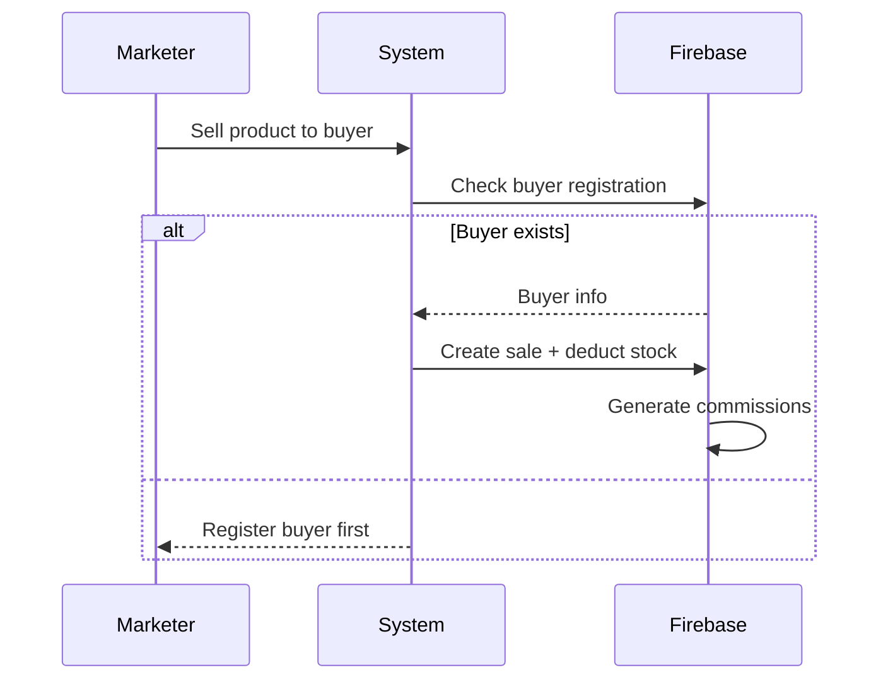

Here's the revised comprehensive schema document incorporating your new requirements:

# MLM Platform Project Schema (v2.0)

**React + Firebase Implementation**

---

## 🗃️ Core Collections

### 1. **Users** Collection

```js
{
  userId: string,           // Auto-ID
  phone: string,           // Unique, E.164 format
  email: string,           // Unique, Firebase Auth email
  name: string,
  role: "marketer" | "distributor" | "admin",
  stock: {                  // Only for marketers/distributors
    "prod_123": 50,
    "prod_456": 20
  },
  commission: number,
  referrerId: string,      // Who introduced this user
  ancestors: array,        // Upline hierarchy
  directDescendants: array,// Immediate downline
  lastPurchaseDate: timestamp
}
```

**Key Features**:

- `stock` field tracks inventory per product
- `role` determines permissions:
  - **Marketers**: Sell products, earn commissions
  - **Distributors**: Transfer stock, no commissions
  - **Admin**: Full system control

---

### 2. **Products** Collection (Admin Managed)

```js
{
  productId: string,       // "prod_healthpack"
  name: string,
  price: number,
  commissionRate: 10,      // Fixed % for all eligible levels
  stockAlertLevel: 50      // Low stock notification
}
```

---

### 3. **Sales** Collection (Marketer Actions)

```js
{
  saleId: string,
  marketerId: string,      // Who made the sale
  buyerPhone: string,      // Buyer's registered phone
  productId: string,
  quantity: number,
  total: number,
  timestamp: timestamp
}
```

**Workflow**:

1. Deduct from marketer's stock
2. Check if buyer exists in system
3. Generate commissions for buyer's referrer chain

---

### 4. **StockTransfers** Collection (Distributor Actions)

```js
{
  transferId: string,
  fromUserId: string,      // Distributor ID
  toUserId: string,
  productId: string,
  quantity: number,
  timestamp: timestamp
}
```

---

### 5. **Commissions** Collection

```js
{
  commissionId: string,
  receiverId: string,      // Marketer getting commission
  saleId: string,
  amount: number,
  status: "pending" | "paid"
}
```

---

## 🔄 Key Workflows

### 1. Marketer Sale Flow



### 2. Commission Calculation Logic

```js
// Cloud Function on sale creation
exports.handleSale = functions.firestore
  .document("Sales/{saleId}")
  .onCreate(async (snap, context) => {
    const sale = snap.data();
    const buyer = await getBuyerByPhone(sale.buyerPhone);

    if (buyer && buyer.referrerId) {
      const product = await getProduct(sale.productId);
      const commission = sale.total * (product.commissionRate / 100);

      // Distribute to referrer and ancestors
      let currentRef = buyer.referrerId;
      while (currentRef) {
        const user = await getUser(currentRef);
        await createCommission(user.userId, commission, sale.saleId);
        currentRef = user.referrerId;
      }
    }
  });
```

---

## 🔒 Security Rules

### Products Collection

```js
match /Products/{product} {
  allow read: true;         // Public product listing
  allow write: if isAdmin();// Only admins can modify
}
```

### Users Collection

```js
match /Users/{userId} {
  allow read: if isAdmin() || isSelf(userId);
  allow update: if isAdmin() ||
    (isMarketer() && request.resource.data.stock != null);
}
```

---

## 👑 Admin Privileges

### Admin Dashboard Features:

1. **User Management**:

   - View all users
   - Change roles (Marketer ↔ Distributor)
   - Reset passwords

2. **Product Management**:

   - Add/edit/delete products
   - Set commission rates
   - View stock levels across network

3. **System Monitoring**:
   - Sales analytics
   - Commission reports
   - Stock movement tracking

---

## 📱 React Implementation Tips

### Sample Component Structure:

```
src/
├── components/
│   ├── AdminPanelComponents/
│   ├── MarketerDashboardComponents/
│   ├── DistributorDashboardComponents/
├── services/
│   ├── firebase.js
│   └── auth.js
└── hooks/
```

---

## 🧪 Example Scenario

**Distributor Action**:

```js
// Stock transfer between users
await db.collection("StockTransfers").add({
  fromUserId: "dist_123",
  toUserId: "mkt_456",
  productId: "prod_healthpack",
  quantity: 10,
  timestamp: new Date(),
});

// Update both users' stock
await db
  .collection("Users")
  .doc("dist_123")
  .update({
    "stock.prod_healthpack": FieldValue.increment(-10),
  });

await db
  .collection("Users")
  .doc("mkt_456")
  .update({
    "stock.prod_healthpack": FieldValue.increment(10),
  });
```

**Marketer Sale**:

```js
// Sale document
const sale = {
  marketerId: "mkt_456",
  buyerPhone: "+123456789",
  productId: "prod_healthpack",
  quantity: 2,
  total: 599.98,
};

// Deduct stock and create sale
await db.collection("Sales").add(sale);
await db
  .collection("Users")
  .doc("mkt_456")
  .update({
    "stock.prod_healthpack": FieldValue.increment(-2),
  });
```

---

## 📌 Next Steps for Development

1. **Implement Core Features**:

   - [ ] Email/Password Firebase Authentication
   - [ ] Role-specific dashboards
   - [ ] Stock transfer interface
   - [ ] Admin product CRUD

2. **Security Setup**:

   - [ ] Configure Firebase Rules
   - [ ] Implement admin role verification
   - [ ] Add purchase validation middleware

3. **Testing**:
   - [ ] Stock transfer between distributors
   - [ ] Commission calculation tests
   - [ ] Admin access control tests
